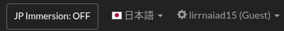

# AtCoder JP Immersion

A small TamperMonkey userscript for Japanese learners using AtCoder as technical Japanese immersion.

When enabled on Japanese AtCoder problem pages, it hides the language dropdown so switching back to English becomes a conscious choice instead of a reflex.

## Features

- Adds a JP Immersion toggle to the AtCoder navbar
- Only appears on Japanese-rendered problem pages
- Hides the language dropdown when enabled
- Saves the toggle state locally
- Does not scrape, translate, submit, or modify contest behavior

## Intended Use

Recommended for:
- upsolving
- solved problems
- easy practice
- Japanese technical reading
- ambiguity tolerance training

Not recommended for:
- live contests where performance matters
- users who need English for accessibility

## Installation and Usage

This is a **Tampermonkey userscript**. Tampermonkey is a browser extension that lets you run small custom JavaScript scripts on specific websites.

### 1. Install Tampermonkey

Install Tampermonkey for your browser:

- Chrome / Chromium-based browsers
- Firefox
- Edge

After installing it, you should see the Tampermonkey icon in your browser toolbar.

### 2. Create a new userscript

1. Click the Tampermonkey icon.
2. Click **Create a new script**.
3. Delete the default code.
4. Copy and paste the contents of `atcoder-jp-immersion.user.js`.
5. Save the script.

### 3. Open AtCoder

Go to an AtCoder problem page in Japanese.

Example:

```text
https://atcoder.jp/contests/abc310/tasks/abc310_a
```

### 4. Use JP Immersion Mode

When the page is in Japanese, you will see a **JP Immersion** toggle in the navbar.

- **OFF**: the language dropdown is visible.
- **ON**: the language dropdown is hidden, making it harder to switch back to English automatically.

On English pages, the toggle does not appear

## Screenshots

### Japanese page — Immersion Mode OFF

The language dropdown is visible as usual.



---

### Japanese page — Immersion Mode ON

The language dropdown is hidden, making English switching more intentional.


---

### English page — Default navbar

On English pages, the JP Immersion toggle is not shown.


